# ModelRouter Architecture: Gateway, Control Plane, and Provider Routing

ModelRouter is a policy-first AI gateway. It presents compatible API surfaces to
clients, authenticates the caller, applies tenant policy and budgets, selects a
provider, records auditable events, and returns a normalized response.

This document follows the system from client request to provider call and back.
It distinguishes capabilities that are available today from the next operational
work that is intentionally still planned.

## How It Works

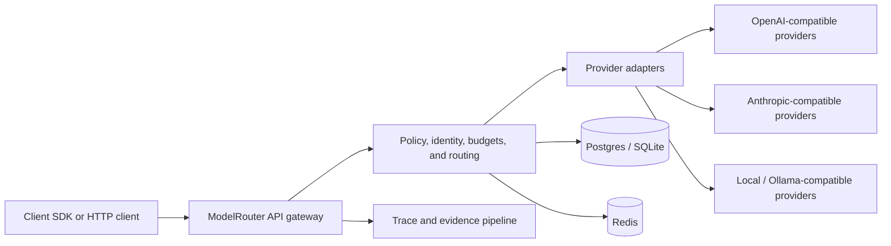

The gateway is the authoritative request path. Provider-specific details stay
inside adapters; tenancy, authorization, accounting, safety policy, routing, and
observability remain consistent regardless of the chosen model.

## Gateway Request Flow

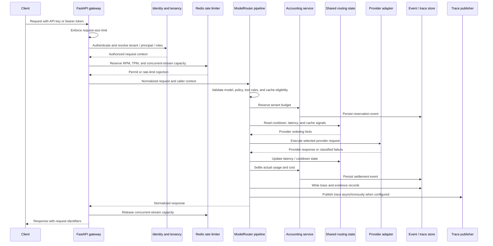

Budget reservation happens before a provider request. If the reservation cannot
be secured, the call does not reach a provider. In a Redis-backed deployment the
reservation ledger protects the budget decision across gateway replicas.

## Gateway Components

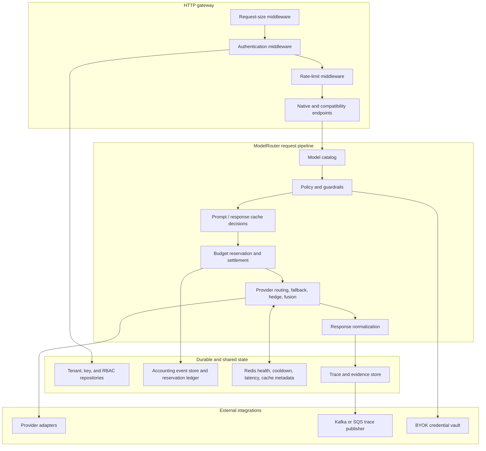

| Component | Responsibility |
| --- | --- |
| FastAPI server | Lifecycle management, HTTP endpoints, middleware, health/readiness routes, and request-context construction. |
| Identity and tenancy | API-key validation, principal resolution, workspace membership, RBAC, and audit logging. |
| Rate limiter | Per-key, per-tenant, and per-user RPM/TPM/concurrency reservations using Redis when configured. |
| ModelRouter pipeline | Model resolution, policy evaluation, accounting, provider selection, retries, fallbacks, and response normalization. |
| Accounting service | Pre-call reservation and post-call settlement from durable accounting events. |
| Provider adapters | Translate normalized requests to individual provider wire formats and classify provider errors. |
| Trace service | Captures request lifecycle evidence; can publish trace events to Kafka or SQS. |

## API Surface

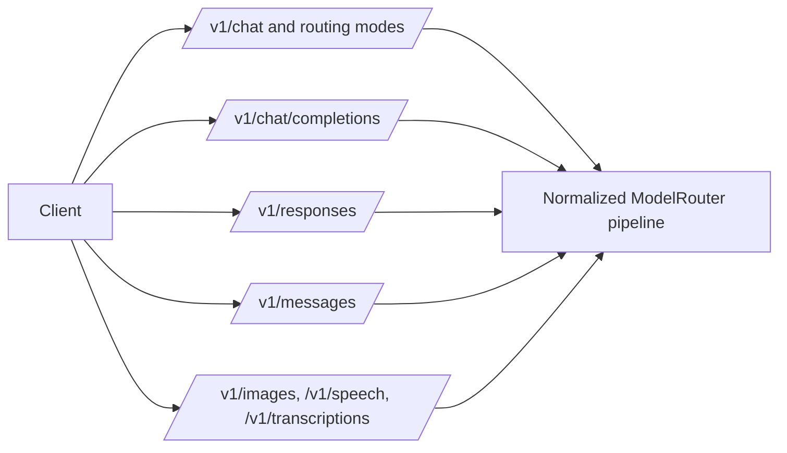

| Surface | Purpose | Current scope |
| --- | --- | --- |
| Native chat routes | Direct access to standard, fallback, hedge, fusion, and bodybuilder routing modes. | Available. |
| OpenAI chat completions | Chat-completions compatibility surface. | Available for supported normalized chat capabilities. |
| OpenAI Responses | Responses-shaped request and result objects. | Non-streaming text/messages subset; broader tool, streaming, and item semantics remain planned. |
| Anthropic messages | Messages-shaped compatibility surface. | Available where requests can map to the normalized chat model. |
| Images, speech, transcription | Media-provider operations. | Available only for configured adapter capabilities. |
| Embeddings, rerank, batches, files | Compatibility expansion work. | Planned; not represented as complete API surfaces. |
| Controlled passthrough | Explicitly governed provider-specific requests. | Planned; it must preserve auth, budgets, tracing, and policy enforcement. |

## Request Processing Model

```mermaid
flowchart LR
    A[Parse request] --> B[Authenticate]
    B --> C[Rate-limit reserve]
    C --> D[Resolve tenant policy and model]
    D --> E[Validate / redact / guardrail]
    E --> F[Check cache policy]
    F --> G[Reserve budget]
    G --> H[Select provider order]
    H --> I[Call provider with retry / fallback]
    I --> J[Normalize result]
    J --> K[Settle usage and emit trace]
    K --> L[Release concurrency]
```

Each stage emits a request identifier and structured outcome. This makes a
rejection (for example: unauthorized, rate-limited, budget-exhausted, policy
blocked, unavailable provider) distinguishable from a provider execution error.

## Routing and Shared State

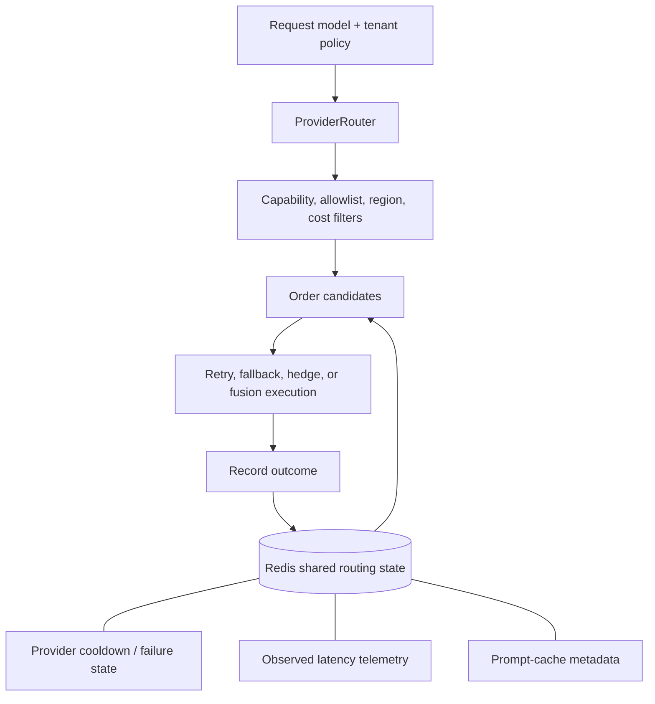

Routing never relies on a single process for production decisions. Redis-backed
state lets replicas share provider cooldowns, observed latency, and cache hints.
The local implementation remains useful for development, but it cannot provide a
cross-replica availability or budget guarantee.

| Signal | Routing use |
| --- | --- |
| Provider health / cooldown | Avoid providers with recent classified failures. |
| Latency telemetry | Prefer candidates with a better recent observed response time when latency routing is selected. |
| Prompt-cache metadata | Prefer cache-warm paths where policy permits. |
| Budget and tenant policy | Reject unaffordable or disallowed candidates before execution. |

## Persistence and Data Access

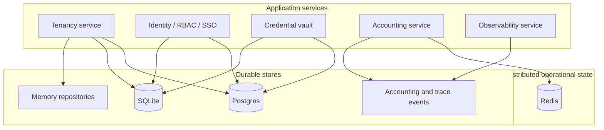

| Concern | Development option | Production option | Notes |
| --- | --- | --- | --- |
| Tenancy and API keys | Memory or SQLite | Postgres | Postgres tenancy repository is implemented. |
| Identity, RBAC, and SSO | SQLite | Postgres | Existing repository semantics are composed through the Postgres database adapter; validate with a real Postgres integration environment before rollout. |
| BYOK credentials | Encrypted local SQLite vault | Encrypted Postgres vault | A master key is required before BYOK is enabled. Plaintext workspace key storage is not used. |
| Accounting | Durable event store | Durable event store plus Redis reservation ledger | The ledger gives cross-replica fast-path reservation protection. |
| Traces and evidence | Local store | Durable store plus Kafka or SQS publisher | ModelRouter trace records remain the source of truth. |
| Rate limits / routing hints | Local process suitable for tests | Redis | Redis is required for distributed limits and shared routing state. |

Schema initialization uses idempotent database creation today. A versioned migration
workflow should be introduced before long-lived production upgrades so schema
changes are reviewed, ordered, and reversible.

## BYOK Credential Flow

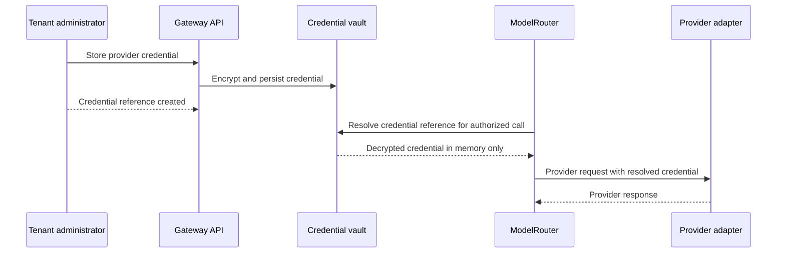

BYOK access is tenant-scoped. Credentials should never be returned by ordinary
read APIs, included in traces, or held in a legacy workspace record.

## Observability and Evidence Flow

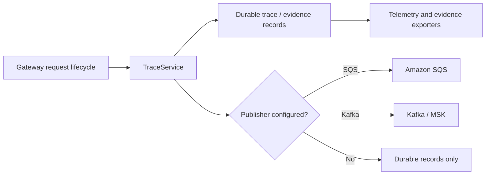

The durable trace is the audit record. External publishers are delivery channels,
not replacements for that source of truth. Additional telemetry exporters for
common destinations are planned and should consume structured trace events rather
than add provider-specific instrumentation to the request path.

## Background Operations

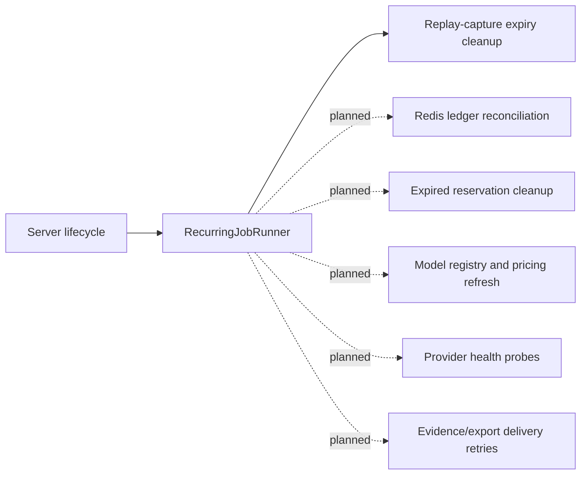

| Job | Status | Purpose |
| --- | --- | --- |
| Replay-capture expiry cleanup | Implemented | Removes expired replay material on a recurring schedule. |
| Reservation reconciliation | Planned | Reconcile the Redis fast ledger against durable accounting events. |
| Expired-reservation cleanup | Planned | Release reservations that cannot be settled after a bounded lifetime. |
| Registry/pricing refresh | Planned | Refresh approved model capabilities and pricing under controlled review. |
| Provider health probes | Planned | Update shared provider availability independently of request traffic. |
| Publisher delivery retries | Planned | Retry transient trace/evidence delivery failures with durable checkpoints. |

## SDK and Library Flow

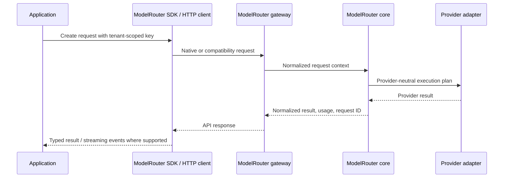

Library callers should use the same request models and policy path as HTTP
callers. Direct adapter invocation is appropriate only for adapter tests and
internal integration work; it bypasses gateway controls.

## Provider Translation Layer

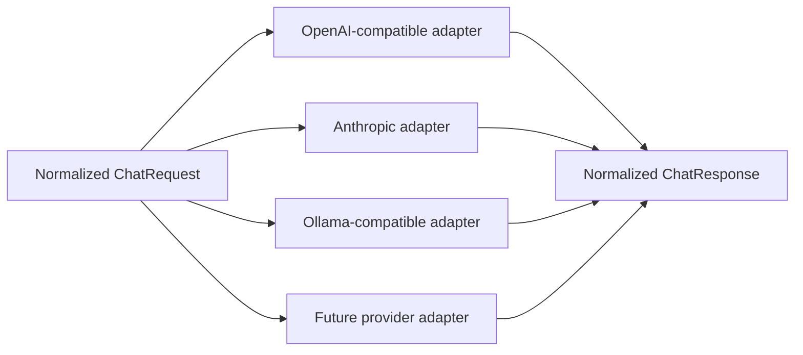

| Layer | Owns |
| --- | --- |
| Compatibility endpoint | Parse the client protocol and construct normalized request data. |
| Core request models | Tenant policy, generic model settings, messages, tools, usage, and error taxonomy. |
| Provider adapter | Provider URL, headers, auth, wire format, streaming parser, capability mapping, and provider-error classification. |
| Normalizer | Stable client response shape, usage data, provider metadata, and request identifiers. |

## Adding or Modifying a Provider

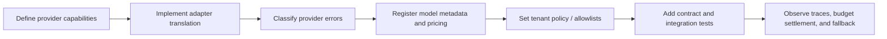

An adapter must not decide tenant authorization or pricing policy itself. Add the
provider's capabilities to the registry, retain a normalized error taxonomy, and
test both its success path and failure behavior under routing fallback.

Provider implementation checklist:

- Map provider request and response types to the normalized request models.
- Support only capabilities that are explicitly declared in model metadata.
- Classify retryable, throttling, authentication, validation, and availability errors.
- Ensure token usage and cost inputs are captured when the provider exposes them.
- Verify sensitive headers and BYOK values are redacted from traces and logs.
- Exercise normal, streaming (if supported), timeout, cooldown, fallback, and settlement cases.

## Testing and Deployment Map

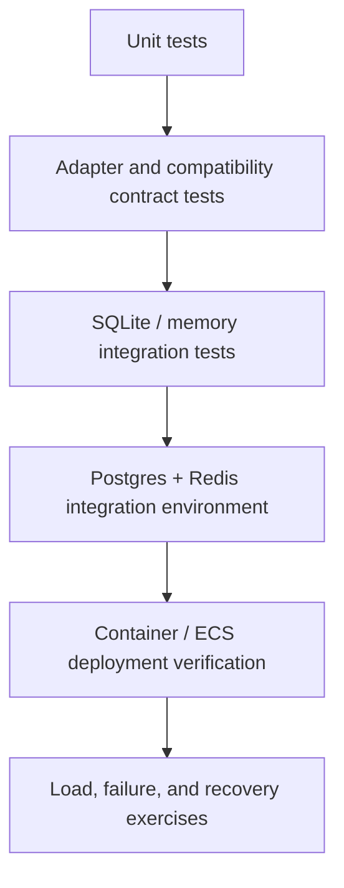

Before a production rollout, verify these exact properties in an environment with
Postgres and Redis rather than relying only on local repository tests:

- A Postgres-backed server starts with tenancy, identity/RBAC, SSO, BYOK, and accounting configured together.
- Two or more replicas cannot exceed the same tenant budget or rate-limit window.
- Provider cooldown and latency signals affect routing consistently across replicas.
- Trace delivery failures do not lose the durable audit record.
- Readiness fails when required configured dependencies are unavailable; liveness remains independent of dependency health.
- Request-size limits, upload limits, and rate limits reject safely before costly provider work begins.

## Architecture Boundaries

ModelRouter is deliberately more than a provider SDK: it is the governed control
point for tenants and providers. The architecture keeps that separation clear:

- Clients receive stable, compatible APIs.
- Core services own policy, budgets, routing, and evidence.
- Adapters own provider protocol details.
- Postgres holds durable business state; Redis holds distributed operational state.
- Background work repairs and refreshes state without placing long-running tasks on request latency.

That boundary makes new providers and compatibility APIs additive, while keeping
the same policy and audit controls around every model call.
